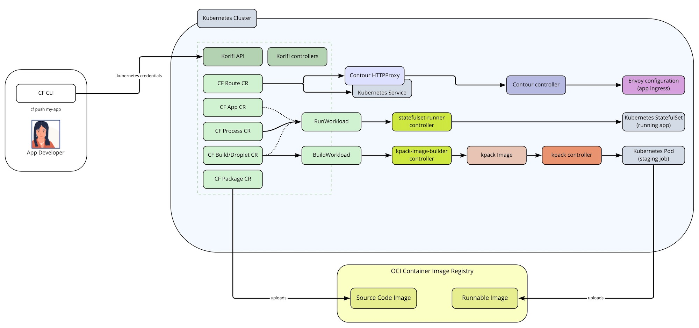

# Korifi Architecture

## Overview

### Core Components
Korifi is built up of the following core components:

* **Korifi CRDs**: A set of Kubernetes custom resources under the `korifi.cloudfoundry.org` Group that implement the core set of [V3 Cloud Foundry resources](https://v3-apidocs.cloudfoundry.org/version/3.117.0/index.html#resources). Users can interact with these custom resources directly through the Kubernetes API (and clients such as `kubectl`) to extend Korifi and implement their own declarative workflows. As we are still in beta, the CRDs are still under development. For the latest list, check out our [types in the source code](https://github.com/cloudfoundry/korifi/tree/main/controllers/api/v1alpha1).
* **korifi-api Deployment**: A Golang implementation of a core set of V3 Cloud Foundry APIs that is backed by the Korifi CRDs. Existing Cloud Foundry API clients (such as the CF CLI) can target the Korifi API and continue to use their existing CF developer workflows.
* **korifi-controllers Deployment**: A set of Kubernetes controllers that implement CF subsystems by orchestrating and reconciling the Korifi CRDs into lower level Kubernetes resources.
* **Korifi Webhooks**: We rely on a set of mutating/validating admission webhooks (that run as part of the korifi-controllers Deployment) to enforce consistent rules and policy for both API and CRD users.

### Extension Points
Korifi includes several custom resources that serve as extension points to provide additional flexibility to operators and developers. Currently, we support the `BuildWorkload` and `AppWorkload` custom resources which are interfaces that abstract away the app staging and running subsystems from the rest of the project. Community members are free to implement their own controllers for these resources to support other build systems and runtimes.

* **BuildWorkload Resource**: A custom resource that serves as an interface to the underlying build system used for staging applications. This resource contains all the information needed to stage an app and controller implementations communicate back via its status. The `kpack-image-builder` controller our provided implementation for application staging that utilizes [kpack](https://github.com/pivotal/kpack) and [Cloud Native Buildpacks](https://buildpacks.io/).

* **AppWorkload Resource**: A custom resource that serves as an interface to the underlying runtime. This resource contains all the information needed to run an app and controller implementations communicate back to the rest of Korifi via its status. The `statefulset-runner` controller (based on eirini-controller) is our provided implementation that runs apps via Kubernetes `StatefulSets`. `StatefulSets` allow us to support features of CF such as the `CF_INSTANCE_INDEX` (an ordered numeric index for each container) environment variable and APIs, but there have been talks to loosen some of this support and use `Deployments` instead.
  * _**Note:** This integration is currently under active development and [eirini-controller](https://github.com/cloudfoundry/eirini-controller) is being used to run `StatefulSets` in the meantime._

Although these are the two areas where we have explicitly defined extension points ([see this proposal for more background on that](https://docs.google.com/document/d/1SqCnM2kHdALoOHr5GDm8K4IKbz4E7CYNEo1f8ETTsMU/edit)) and pluggable controllers, CRDs by their nature lead to very loose coupling between components. Some of our other resources, like the `CFRoute`, could also become more official extension points in the future -- it mostly is a matter of making it easy for one of our built-in controllers to be disabled and swapped out.

### Dependencies
As mentioned earlier, we aim to be loosely coupled with our dependencies and interact with them through defined, pluggable interfaces. That said, currently we depend on the following for both core Korifi / the provided controllers that implement some of our pluggable subsystems.

* **cert-manager**: We use [cert-manager](https://cert-manager.io/) to generate and rotate the internal certs used for our webhooks.
* **metrics-server**: We use [metrics-server](https://github.com/kubernetes-sigs/metrics-server) to expose app container metrics to developers.
* **kpack**: We use [kpack](https://github.com/pivotal/kpack) and [Cloud Native Buildpacks](https://buildpacks.io/) to stage apps via the `kpack-image-builder` controller. This dependency sits behind our `BuildWorkload` abstraction and the `kpack-image-builder` controller could be replaced with alternative staging implementations.
* **Contour**: We use [Contour](https://projectcontour.io/) as our ingress controller. Contour is a CNCF project that serves as a control plane for [Envoy Proxy](https://www.envoyproxy.io/) that provides a robust, lightweight ingress routing solution. Our `CFRoute` resources are reconciled into Contour `HTTPProxy` and K8s `Service` resources to implement app ingress routing. Contour is also being used to drive out the implementation of the new [Kubernetes Gateway APIs](https://gateway-api.sigs.k8s.io/) (aka Ingress v2) which we plan on switching to once they mature and move out of alpha.
* **Service Bindings for Kubernetes**: Korifi supports the [Service Bindings for Kubernetes](https://servicebinding.io/) `ServiceBinding` resource. A `ServiceBinding` reconciler (such as [service-binding-controller](https://github.com/servicebinding/service-binding-controller)) is required for those resources to be reconciled correctly and volume mounted on to app workloads.

---

## Deeper Dives

### Authentication and Authorization
Korifi relies on the Kubernetes API and RBAC (`Roles`, `ClusterRoles`, `RoleBindings`, etc.) for authentication and authorization (aka auth(n/z)). Users authenticate using their Kubernetes cluster credentials and either interact with the CRDs directly or send their credentials to the Korifi API layer to interact with the resources on their behalf. [Cloud Foundry roles](https://docs.cloudfoundry.org/concepts/roles.html) (such as `SpaceDeveloper`) have corresponding `ClusterRoles` on the cluster and commands like `cf set-space-role` result in `RoleBindings` being created in the appropriate namespaces.

Check out the [User Authentication Overview docs](user-authentication-overview.md) for more details on our auth(n/z) strategy.

### Organization and Space Hierarchy / Multi-tenancy
Cloud Foundry has a tiered tenancy system consisting of the cluster or "foundation" level, organization level, and space level. The CF foundation will contain one or more organizations which will themselves contain one or more spaces. CF roles typically allow for read/write access in these various areas. For example, a "CF Admin" user can make shared domains for the entire CF installation as well as interact with apps within an individual space, while a "Space Developer" user will typically be able to view things within their org as well as push apps within their space.

We model these using Kubernetes namespaces. There is a root "cf" namespace that can contain multiple `CFOrg` custom resources. These trigger the creation of K8s namespaces for each org which themselves will contain `CFSpace` resources that point to additional namespaces for each space. This is convenient because it maps closely to the CF model in terms of app isolation and user permissions on Kubernetes. Initially we used the [Hierarchical Namespaces Controller project](https://github.com/kubernetes-sigs/hierarchical-namespaces) to manage this hierarchy, but moved away to a custom implementation for [various reasons](https://docs.google.com/document/d/1AVZPcoOphbWU8tVJ2gM7UkEC0EvHaki6scWgp8DuCDY/edit).

### Object Storage for App Artifacts
Korifi does not use an object store / [blobstore](https://docs.cloudfoundry.org/concepts/cc-blobstore.html) (e.g. Amazon S3, WebDav, etc.) to store app source code packages and runnable app droplets like CF for VMs. Instead, we rely on a container registry (e.g. DockerHub, Harbor, etc.) since all Kubernetes clusters require one to source their image. App source code (via the `CFPackage` resource) is transformed into a single layer [OCI-spec container image](https://opencontainers.org/) and stored on the container registry instead of as a zip file on a blobstore. Likewise, we no longer use the custom "droplet" (zip file container runnable app source) + "stack" concept from CF for VMs. The build system produces container images (also stored in the container registry) that can be run anywhere.

---

## Misc

### Architecture Decision Records and Proposals
We primarily propose changes and record decisions in two places:

1. As [Architecture Decision Records (ADRs)](https://github.com/cloudfoundry/korifi/tree/main/docs/architecture-decisions)
2. As [Proposal documents](https://github.com/orgs/cloudfoundry/projects/14)

Check out those out for more information on past decisions and potential upcoming changes.

We typically use ADRs to record context about decisions that were already made or discussed as a team and proposals to discuss larger changes or check out tracks of work. More details on each type of document and their templates can be found [here](https://docs.google.com/document/d/1sLQzxq7KwBPE7H24ZuR7vtHTQaWOgTDDSypMGk0FgKA/edit).

### CF <--> Kubernetes Resource Mappings

| Cloud Foundry Concept/Resource | Kubernetes Representation                                                                                  |
|--------------------------------|------------------------------------------------------------------------------------------------------------|
| CF User                        | Kubernetes RBAC User / Service Account                                                                     |
| UAA Oauth2 Token               | Kubernetes auth token or client cert/key                                                                   |
| Roles/Permissions              | Kubernetes RBAC resources                                                                                  |
| Organization                   | CFOrg + Namespace                                                                                          |
| Space                          | CFSpace + Namespace                                                                                        |
| App                            | CFApp                                                                                                      |
| App Env Vars                   | Kubernetes Secret                                                                                          |
| Package (app source code)      | CFPackage + OCI Container Image                                                                            |
| Build                          | CFBuild, BuildWorkload, Kpack Image                                                                        |
| Droplet                        | CFBuild, BuildWorkload, OCI Container Image                                                                |
| Process                        | CFProcess                                                                                                  |
| Route                          | CFRoute, Contour HTTPProxy, K8s Service                                                                    |
| Domain                         | CFDomain                                                                                                   |
| Service Instance               | CFServiceInstance ([ProvisionedService](https://github.com/servicebinding/spec#provisioned-service))       |
| Service Binding                | CFServiceBinding + [ServiceBinding for Kubernetes](https://github.com/servicebinding/spec#service-binding) |
| Service credentials            | Kubernetes Secret                                                                                          |
| Diego Desired LRP              | AppWorkload + StatefulSet                                                                                  |
| Diego Actual LRP               | Kubernetes Pod                                                                                             |
