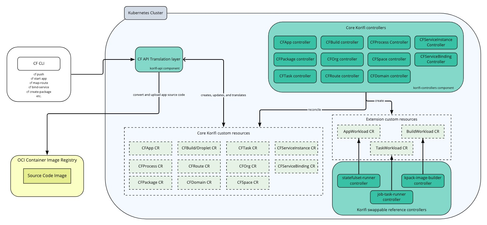
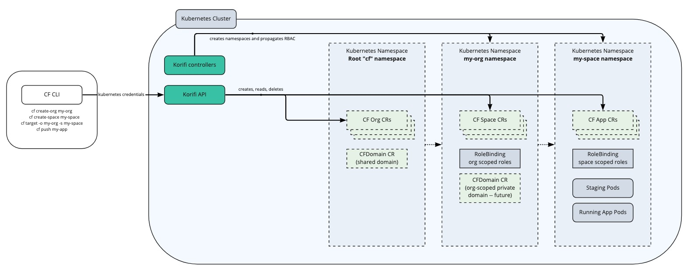
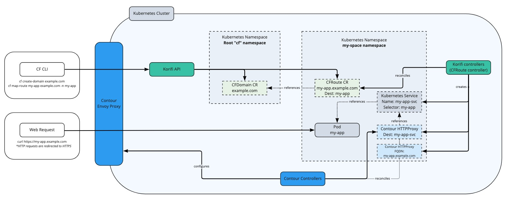
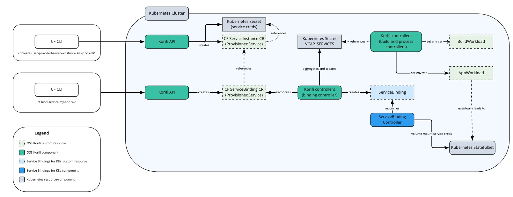
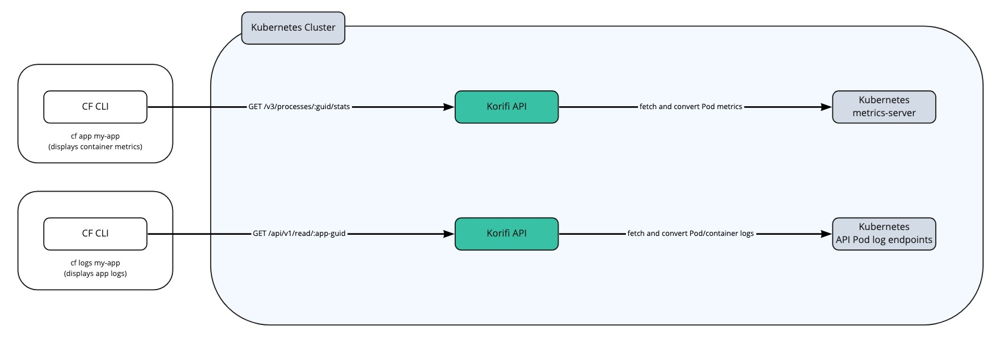

# Korifi Architecture

## Overview

### Core Components
Korifi is built up of the following core components:

* **Korifi CRDs**: A set of Kubernetes custom resources under the `korifi.cloudfoundry.org` Group that implement the core set of [V3 Cloud Foundry resources](https://v3-apidocs.cloudfoundry.org/version/3.117.0/index.html#resources). Users can interact with these custom resources directly through the Kubernetes API (and clients such as `kubectl`) to extend Korifi and implement their own declarative workflows. As we are still in beta, the CRDs are still under development. For the latest list, check out our [types in the source code](https://github.com/cloudfoundry/korifi/tree/main/controllers/api/v1alpha1).
* **korifi-api Deployment**: A Golang implementation of a core set of V3 Cloud Foundry APIs that is backed by the Korifi CRDs. Existing Cloud Foundry API clients (such as the CF CLI) can target the Korifi API and continue to use their existing CF developer workflows.
* **korifi-controllers Deployment**: A set of Kubernetes controllers that implement core CF subsystems by orchestrating and reconciling the Korifi CRDs into lower level Kubernetes resources. This Deployment also runs the default implementations of the builder, runner, and routing implementations.
* **Korifi Webhooks**: We rely on a set of mutating/validating admission webhooks (that run as part of the korifi-controllers Deployment) to enforce consistent rules and policy for both API and CRD users.

### Extension Points
Korifi includes several custom resources that serve as extension points to provide additional flexibility to operators and developers. Currently, we provide the `BuildWorkload`, `AppWorkload`, and `TaskWorkload` custom resources as interfaces that abstract away the app staging and running subsystems from the rest of the project. Platform teams (and the Korifi community in general) are welcome to implement their own controllers for these resources to support other build systems and runtimes.

* **BuildWorkload Resource**: A custom resource that serves as an interface to the underlying build system used for staging applications. This resource contains all the information needed to stage an app and controller implementations communicate back via its status. The `kpack-image-builder` controller is our reference implementation for application staging that utilizes [kpack](https://github.com/pivotal/kpack) and [Cloud Native Buildpacks](https://buildpacks.io/).

* **AppWorkload Resource**: A custom resource that serves as an interface to the underlying runtime. This resource contains all the information needed to run an app, and controller implementations communicate back to the rest of Korifi via its status. The `statefulset-runner` controller is our reference implementation that runs apps via Kubernetes `StatefulSets`. `StatefulSets` allow us to support features of CF such as the `CF_INSTANCE_INDEX` (an ordered numeric index for each container) environment variable and APIs, but there have been talks to loosen some of this support and use `Deployments` instead.

* **TaskWorkload Resource**: A custom resource that serves as an interface to the underlying runtime. This resource contains all the information needed to run a task, and controller implementations communicate back to the rest of Korifi via its status. The `job-task-runner` controller is our reference implementation that runs tasks via Kubernetes `Jobs`.

Although these are the three areas where we have explicitly defined extension points ([see this proposal for more background on that](https://docs.google.com/document/d/1SqCnM2kHdALoOHr5GDm8K4IKbz4E7CYNEo1f8ETTsMU/edit)) and pluggable controllers, CRDs by their nature lead to very loose coupling between components. The `CFRoute` resource, for example, can be considered both a core Korifi CRD (it is required for implementing the V3 Route endpoints) and an extension point resource since it includes all the necessary information needed to describe a Cloud Foundry route. Other resources (Service Instances and Bindings?) may also evolve overtime to support this kind of flexibility.

All of these default implementations are built into the korifi-controllers Deployment and can be toggled on and off individually via Helm properties.

### Dependencies
As mentioned earlier, we aim to be loosely coupled with our dependencies and interact with them through defined, pluggable interfaces. That said, currently we depend on the following for both core Korifi / the provided controllers that implement some of our pluggable subsystems.

* **cert-manager**: We use [cert-manager](https://cert-manager.io/) to generate and rotate the internal certs used for our webhooks.
* **metrics-server**: We use [metrics-server](https://github.com/kubernetes-sigs/metrics-server) to expose app container metrics to developers.
* **kpack**: We use [kpack](https://github.com/pivotal/kpack) and [Cloud Native Buildpacks](https://buildpacks.io/) to stage apps via the `kpack-image-builder` controller. This dependency sits behind our `BuildWorkload` abstraction and the `kpack-image-builder` controller could be replaced with alternative staging implementations.
* **Contour**: We use [Contour](https://projectcontour.io/) as our ingress controller. Contour is a CNCF project that serves as a control plane for [Envoy Proxy](https://www.envoyproxy.io/) that provides a robust, lightweight ingress routing solution. Our `CFRoute` resources are reconciled into Contour `HTTPProxy` and K8s `Service` resources to implement app ingress routing. Contour is also being used to drive out the implementation of the new [Kubernetes Gateway APIs](https://gateway-api.sigs.k8s.io/) (aka Ingress v2) which we plan on switching to once they mature and move out of alpha.
* **Service Bindings for Kubernetes**: Korifi supports the [Service Bindings for Kubernetes](https://servicebinding.io/) `ServiceBinding` resource. A `ServiceBinding` reconciler (such as [service-binding-controller](https://github.com/servicebinding/service-binding-controller)) is required for those resources to be reconciled correctly and volume mounted on to app workloads.

---

## Deeper Dives

### Korifi Core

Korifi provides a CF API translation layer that implements a subset of the v3 Cloud Foundry APIs. The v3 CF APIs are generally RESTful and enable granular interaction with the CF resources. A simple command such as "cf push" will call dozens of discrete API endpoints in order to orchestrate the push.

1. `POST /v3/spaces/<space_guid>/actions/apply_manifest`
2. `GET /v3/jobs/<job_guid>`
3. `GET /v3/apps?name=<app_name>&space_guids=<space_guid>`
4. `GET /v3/packages`
5. `POST /v3/packages/<package_guid>/upload`
6. `GET /v3/packages/<package_guid>`
7. `POST /v3/builds`
8. _and so on..._

To implement these various endpoints, we ported over the relevant CF resources in the form of Kubernetes custom resources. So instead of having a row in the apps table in Cloud Controller's database, we have a `CFApp` custom resource. Similar resources exist for Processes, Routes, etc. Two core Korifi components handle the translation and lifecycle of these resources: the Korifi API and Korifi Controllers.

#### Korifi API
The Korifi API performs three primary functions:

1. It translates requests from a CF API client (such as the CLI) into Kubernetes API requests that create, read, update, and otherwise interpret the various CF custom resources.
2. It translates responses from the Kubernetes logging endpoints and metrics-server into CF compatible responses.
3. It uses libraries from the kpack project to convert application source code from the CF CLI (zip files) into OCI images

#### Korifi Controllers
The Korifi Controllers component is a single process that runs a set of Kubernetes controllers that were built using the [kubebuilder](https://github.com/kubernetes-sigs/kubebuilder) framework as scaffolding. These controllers watch their respective custom resources and either transform them into downstream resources (e.g. a `CFRoute` becomes a Contour `HTTPProxy`  and Kubernetes `Service`) and/or do bookkeeping such as propagate status and actual state upwards so that the Korifi API can return it back to CF clients (e.g. is a `Pod` running or did a kpack `Build` succeed). For the most part these controllers are translational and the actual developer outcomes are handled by the components we integrate with.

#### Korifi CRDs
Although we expect most users to interact with Korifi using existing CF API clients, the true "API" for Korifi is actually its custom resources. Since these resources extend the Kubernetes API and authentication is handled by it, users can use any K8s API client (such as `kubectl`, `client-go`, `k9s`, etc.) to view and manipulate the Korifi resources directly.

Some examples:
* Orgs and spaces can be declaratively managed via the `CFOrg` and `CFSpace` resources and roles can be applied by creating K8s `RoleBindings`.
* An app developer could orchestrate their own "cf push" by directly manipulating the `CFApp`, `CFPackage`, and `CFBuild` resources.
* An operator could use [k9s](https://k9scli.io/) or a generic Kubernetes GUI to visualize their Korifi installation and all apps running on the cluster.

### Authentication and Authorization
Korifi relies on the Kubernetes API and RBAC (`Roles`, `ClusterRoles`, `RoleBindings`, etc.) for authentication and authorization (aka auth(n/z)). Users authenticate using their Kubernetes cluster credentials and either interact with the CRDs directly or send their credentials to the Korifi API layer to interact with the resources on their behalf. [Cloud Foundry roles](https://docs.cloudfoundry.org/concepts/roles.html) (such as `SpaceDeveloper`) have corresponding `ClusterRoles` on the cluster and commands like `cf set-space-role` result in `RoleBindings` being created in the appropriate namespaces.

Check out the [User Authentication Overview docs](user-authentication-overview.md) for more details on our auth(n/z) strategy.

### Organization and Space Hierarchy / Multi-tenancy

Cloud Foundry has a tiered tenancy system consisting of the cluster or "foundation" level, organization level, and space level. The CF foundation will contain one or more organizations which will themselves contain one or more spaces. CF roles typically allow for read/write access in these various areas. For example, a "CF Admin" user can make shared domains for the entire CF installation as well as interact with apps within an individual space, while a "Space Developer" user will typically be able to view things within their org as well as push apps within their space.

We model these using Kubernetes namespaces. There is a root "cf" namespace that can contain multiple `CFOrg` custom resources. These trigger the creation of K8s namespaces for each org which themselves will contain `CFSpace` resources that point to additional namespaces for each space. This is convenient because it maps closely to the CF model in terms of app isolation and user permissions on Kubernetes. Initially we used the [Hierarchical Namespaces Controller project](https://github.com/kubernetes-sigs/hierarchical-namespaces) to manage this hierarchy, but moved away to a custom implementation for [various reasons](https://docs.google.com/document/d/1AVZPcoOphbWU8tVJ2gM7UkEC0EvHaki6scWgp8DuCDY/edit).

### Routing

We currently integrate directly with Contour to implement routing to both the Korifi API and app workloads. The `CFRoute` custom resource supports the  CF route management APIs and is converted into Contour `HTTPProxy` and Kubernetes `Service` resources. We use a validating webhook to apply Cloud Controller's validation rules to the routes (e.g. no duplicate routes, route has a matching `CFDomain`, etc).

**Future Plans:** We want to decouple ourselves from Contour and adopt the [Kubernetes Gateway API](https://gateway-api.sigs.k8s.io/) (aka Ingress v2) once those interfaces mature and support the features we require. Contour has been used to develop and influence these new APIs, so it should be a fairly straightforward replacement. This will enable Korifi to support a wider variety of ingress providers going forward (e.g. Envoy Gateway, Istio, etc.)).

### Service Management

We currently support the CF APIs for managing and binding [user-provided service instances](https://docs.cloudfoundry.org/devguide/services/user-provided.html) (UPSIs) by providing two custom resources: the `CFServiceInstance` and `CFServiceBinding`. These CRs primarily exist to back the CF APIs and store additional state that isn't relevant in downstream service resources. They implement the [ProvisionedService "duck type"](https://servicebinding.io/spec/core/1.0.0/#provisioned-service) from the [Service Bindings for Kubernetes spec](https://servicebinding.io/) which allow them to interoperate directly with other projects surrounding the Kubernetes Service Bindings ecosystem (kpack, ServiceBinding reconcilers, etc.).

UPSIs enable devs to provide their own service credentials (can be sourced from anywhere) and have them projected onto workloads in the same way that CF would project credentials from managed services. For Korifi we aim to provide compatibility for existing Cloud Foundry applications by aggregating these UPSI credentials and providing them to workloads through the [`VCAP_SERVICES` environment variable](https://docs.cloudfoundry.org/devguide/deploy-apps/environment-variable.html#VCAP-SERVICES). Additionally, we integrate with the reference Service Bindings reconciler via the "Service Bindings for Kubernetes" [`ServiceBinding` resource](https://servicebinding.io/spec/core/1.0.0/#service-binding) to volume mount these credentials onto workload `Pods`. This enables apps that are pushed with Korifi to interoperate with binding-aware Cloud Native Buildpacks as well as updated app frameworks like [Spring Cloud Bindings](https://github.com/spring-cloud/spring-cloud-bindings).

### Logging and Metrics

Korifi supports best effort access to current logs and resource metrics through the "cf app", "cf logs", and "cf push" (staging logs) commands. We do this by implementing the CF APIs for accessing these resources and querying the Kubernetes `metrics-server` component for Pod container metrics (memory and CPU) and the Kubernetes API's Pod log endpoint to fetch logs from the staging/running containers for Apps. The Korifi API translates these metrics and logs into CF API responses that existing CF clients understand.

We do not plan on porting over the existing CF for VMs logging and metrics stack due to its complexity and the fact that there are alternatives available in the Kubernetes community. For more reliable access to app logs/metrics and more durable storage we recommend using Kubernetes-native tools like [Prometheus](https://prometheus.io/) for collecting app metrics and [fluentbit](https://fluentbit.io/) sidecars for log egress.

### Object Storage for App Artifacts
Korifi does not use an object store / [blobstore](https://docs.cloudfoundry.org/concepts/cc-blobstore.html) (e.g. Amazon S3, WebDav, etc.) to store app source code packages and runnable app droplets like CF for VMs. Instead, we rely on a container registry (e.g. DockerHub, Harbor, etc.) since all Kubernetes clusters require one to source their image. App source code (via the `CFPackage` resource) is transformed into a single layer [OCI-spec container image](https://opencontainers.org/) and stored on the container registry instead of as a zip file on a blobstore. Likewise, we no longer use the custom "droplet" (zip file container runnable app source) + "stack" concept from CF for VMs. The build system produces container images (also stored in the container registry) that can be run anywhere.

---

## Misc

### Architecture Decision Records and Proposals
We primarily propose changes and record decisions in two places:

1. As [Architecture Decision Records (ADRs)](https://github.com/cloudfoundry/korifi/tree/main/docs/architecture-decisions)
2. As [Proposal documents](https://github.com/orgs/cloudfoundry/projects/14)

Check out those out for more information on past decisions and potential upcoming changes.

We typically use ADRs to record context about decisions that were already made or discussed as a team and proposals to discuss larger changes or check out tracks of work. More details on each type of document and their templates can be found [here](https://docs.google.com/document/d/1sLQzxq7KwBPE7H24ZuR7vtHTQaWOgTDDSypMGk0FgKA/edit).

### CF <--> Kubernetes Resource Mappings

| Cloud Foundry Concept/Resource | Kubernetes Representation                                                                                  |
|--------------------------------|------------------------------------------------------------------------------------------------------------|
| CF User                        | Kubernetes RBAC User / Service Account                                                                     |
| UAA Oauth2 Token               | Kubernetes auth token or client cert/key                                                                   |
| Roles/Permissions              | Kubernetes RBAC resources                                                                                  |
| Organization                   | CFOrg + Namespace                                                                                          |
| Space                          | CFSpace + Namespace                                                                                        |
| App                            | CFApp                                                                                                      |
| App Env Vars                   | Kubernetes Secret                                                                                          |
| Package (app source code)      | CFPackage + OCI Container Image                                                                            |
| Build                          | CFBuild, BuildWorkload, Kpack Image                                                                        |
| Droplet                        | CFBuild, BuildWorkload, OCI Container Image                                                                |
| Process                        | CFProcess, AppWorkload (eventually StatefulSet and Pod)                                                    |
| Task                           | CFTask, TaskWorkload (eventually Kubernetes Job and Pod)                                                   |
| Route                          | CFRoute, Contour HTTPProxy, K8s Service                                                                    |
| Domain                         | CFDomain                                                                                                   |
| Service Instance               | CFServiceInstance ([ProvisionedService](https://github.com/servicebinding/spec#provisioned-service))       |
| Service Binding                | CFServiceBinding + [ServiceBinding for Kubernetes](https://github.com/servicebinding/spec#service-binding) |
| Service credentials            | Kubernetes Secret                                                                                          |
| Diego Desired LRP              | AppWorkload + StatefulSet                                                                                  |
| Diego Actual LRP               | Kubernetes Pod                                                                                             |
