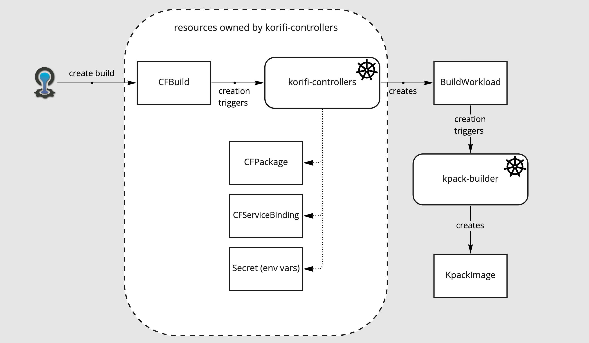
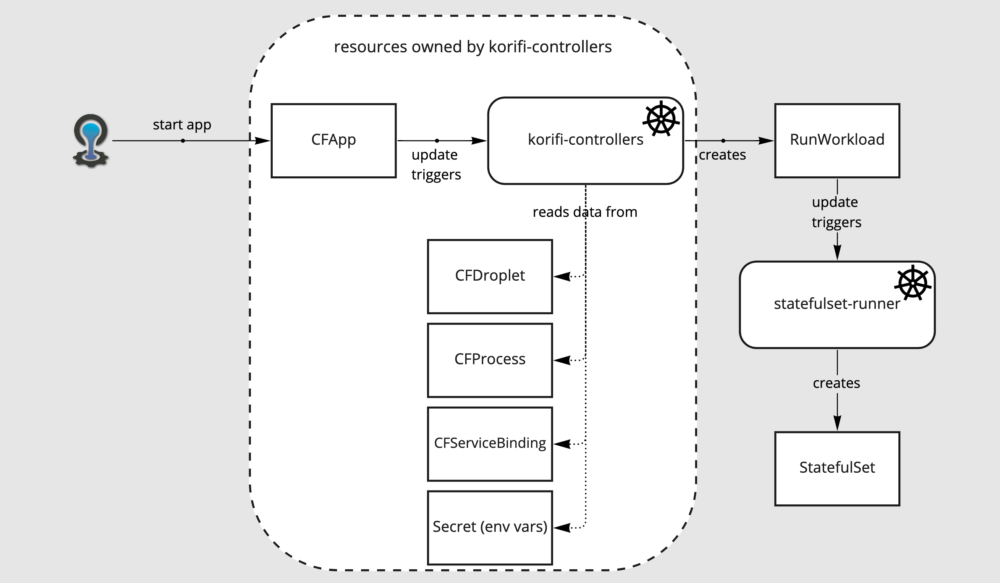

# Meta
[meta]: #meta
- Name: Support Interchangeable Build and Run Implementations
- Start Date: 2022-04-18
- Author(s): @matt-royal
- Status: Draft
- RFC Pull Request: (leave blank)
- Supersedes: N/A

# Summary
[summary]: #summary

This RFC proposes changing the Korifi architecture so that the software that orchestrates the build and run steps is
outside the `korifi` codebase, so that these flows can be customized and implemented in different ways. To support this,
we will add the new `BuildWorkload` and `RunWorkload` resources, which contain all information necessary to execute
their respective processes. The `korifi-controllers` will create these resources, and separate (interchangeable)
components will reconcile them to build images and run long-running processes. We will provide default implementations
of these reconcilers that work the same way Korifi currently works (via kpack Images and statefulsets,
respectively), but operators can choose to deploy alternatives that implement these flows differently.

# Motivation
[motivation]: #motivation

The build and run implementations are currently baked into korifi-controllers and cannot be changed. While the current
implementation of these flows may be sufficient for most use cases, there are many reasons operators may want to swap in
alternate logic. Some examples:

- Using `Deployment`, knative, or other alternative resources for run workloads
- Signing container images in the build step, and requiring signed images in the run step
- Security scanning container images during the build and/or run steps
- Applying conventions to pod spec, such as labels, annotations, volume mounts, etc.

We could accomplish this flexibility with a smaller change: splitting out the current reconcilers for `CFBuild` and
`CFProcess` into their own repositories, so they can be replaced with alternatives. The issue with this change is that
the existing reconcilers use information from many resources and an alternative implementation would have to duplicate
this complex logic. For example, to create the LRPs that currently generate the run step's stateful set, the `CFProcess`
reconciler uses `CFProcess`, `CFApp`, `CFPackage`, `CFServiceBinding`, and `Secret` resources.

The new `BuildWorkload` and `RunWorkload` solve this problem by placing all necessary information on a single resource.
As a consequence, the build and run controllers can focus on implementing their respective flows without having to fetch
and correlate multiple resources. These resources also provide a standard way to report status back to
the `korifi-controllers` without directly modifying Korifi domain resources.

# What it is
[what-it-is]: #what-it-is

Here are the various resources and components involved:

- `BuildWorkload` - a new Custom Resource Definition, with fields that contain all necessary information to execute the
  build step for a korifi workload. This resource contains information from `CFBuild`, `CFPackage`, `CFServiceBinding`,
  and the App's `Secret` resources. This CRD may exist in a new, separate API Group to indicate its status as an
  external interface.

- `RunWorkload` - a new Custom Resource Definition, with fields that contain all necessary information to execute the
  run step for a korifi workload. This will be similar to the existing Eirini `LRP` CRD, but with some improvements to
  simplify construction of a pod spec template. This resource contains information from `CFApp`, `CFProcess`,
  `CFBuild/CFDroplet`, and the App's `Secret` resources. This CRD may exist in a new, separate API Group to indicate its
  status as an external interface. We may even want to reclaim the `workloads.cloudfoundry.org` group for this purpose
  and choose another for the existing resources.

- build workload reconciler - a separate component from `korifi-controllers` that reconciles `BuildWorkload` resources
  to execute the build workflow. Eventually multiple implementations of this reconciler will exist, each implementing
  the build workflow in a different way to meet operator needs. These CRDs may exist in a new, separate API Group to
  indicate their status as an external interface. We may even want to reclaim the `workloads.cloudfoundry.org` group for
  this purpose and choose another for the existing resources.

- run workload reconciler - similar to the build workload reconciler, but for `RunWorkload` resources.

- the `CFBuild` reconciler: a component of `korifi-controllers` that creates `BuildWorkload` resources and monitors
  their status to keep the `CFBuild` and/or `CFDroplet` resources up to date.

- the `CFProcess` reconciler: a component of `korifi-controllers` that creates `RunWorkload` resources and monitors
  their status to keep `CFApp` and/or `CFProcess` resources up to date.

- the `CFServiceBinding` reconciler: a new component of `korifi-controllers` that creates and updates a `Secret`
  resource for each app, containing the `VCAP_SERVICES` environment variable. This secret is referenced by both
  the `BuildWorkload` and `RunWorkload` resources.


# How it Works
[how-it-works]: #how-it-works

These diagrams demonstrate the various k8s resources and how they're related:





Here are some (DRAFT) sample resources:

```yaml
apiVersion: TBD.cloudfoundry.org/v1alpha1
kind: BuildWorkload
metadata:
  name: my-build-guid
  namespace: my-space-guid
spec:
  env:
    - name: VCAP_SERVICES
      valueFrom:
        secretKeyRef:
          key: VCAP_SERVICES
          name: vcap-services-secret
  buildpacks: [] # Use empty to indicate "default"?
  stack: io.buildpacks.stacks.bionic
  source:
    registry:
      image: localregistry-docker-registry.default.svc.cluster.local:30050/kpack/packages/eb60d1d0-5de1-4051-ac05-a4047f2b191a@sha256:987d6b085314a16ba5566fd0821d5a2f59e1a54ea11b8c0e2cd09309482d0481
      imagePullSecrets:
        - name: image-registry-credentials
status:
  conditions:
  - status: 'False'
    type: Staging
  - status: 'True'
    type: Succeeded
  droplet:
    ports: []
    processTypes:
      - command: node /workspace/server.js
        type: web
    registry:
      image: localregistry-docker-registry.default.svc.cluster.local:30050/korifi-controllers/kpack/images/dbcee519-d239-4272-a264-3c1ce36a3e0a@sha256:6cee35c7d3ddc688bc45745e7c54432063221f71c6a092a649dcdff17a028c90
      imagePullSecrets:
        - name: image-registry-credentials
    stack: io.buildpacks.stacks.bionic
```

```yaml
---
apiVersion: TBD.cloudfoundry.org/v1alpha1
kind: RunWorkload
metadata:
  name: my-proc-guid
  namespace: my-space-guid
spec:
  command:
    - /cnb/lifecycle/launcher
    - node /workspace/server.js
  
  resources:
    limits:
      ephemeral-storage: 1024M
      memory: 1024M
    requests:
      cpu: '0'
      memory: 1024M
      
  envFrom:
    - secretRef:
        name: user-specified-env-vars
        
  env:
    - name: VCAP_APP_HOST
      value: 0.0.0.0
    - name: VCAP_APP_PORT
      value: '8080'
    - name: VCAP_SERVICES
      valueFrom:
        secretKeyRef:
          key: VCAP_SERVICES
          name: vcap-services-secret
    - name: PORT
      value: '8080'
    - name: POD_NAME
      valueFrom:
        fieldRef:
          apiVersion: v1
          fieldPath: metadata.name
    - name: CF_INSTANCE_GUID
      valueFrom:
        fieldRef:
          apiVersion: v1
          fieldPath: metadata.uid
    - name: CF_INSTANCE_IP
      valueFrom:
        fieldRef:
          apiVersion: v1
          fieldPath: status.hostIP
    - name: CF_INSTANCE_INTERNAL_IP
      valueFrom:
        fieldRef:
          apiVersion: v1
          fieldPath: status.podIP
          
  livenessProbe: #...
  readinessProbe: #...
  image: localregistry-docker-registry.default.svc.cluster.local:30050/cf-k8s-controllers/kpack/images/ff5b920f-c729-4284-9ae9-241d95b98528@sha256:7a7ed9b42905c6fabd71ea09eb22b97e0c638c9a341a70c84f9461e167c9f50f
  imagePullSecrets:
    - name: image-registry-credentials 
  
  instances: 1
  
  version: '0'
```


# Migration
[migration]: #migration

This will be a breaking change, but we haven't made any guarantee about upgrades. Existing installations will need to be
torn down and any workloads will need to be pushed from scratch.

There is one migration scenario we should consider: how can an operator migrate from one build/run reconciler to another
on an existing cluster? We could mandate that each reconciler take possession of a Workload it's reconciled by setting
an appropriate annotation on it. Reconcilers could then verify that a workload is either unowned or that it is the owner
before working on it.

# Drawbacks
[drawbacks]: #drawbacks

Why should we *not* do this?

- This adds complexity to our existing implementation, as a cost for the added flexibility.

# Alternatives
[alternatives]: #alternatives

- What other designs have been considered?
    - Keeping the reconciler logic all inside of the `korifi` codebase, but with logic switches to handle different
      workload implementations. However, this makes it difficult for third parties to implement their desired workflows,
      and also makes it harder to experiment or deprecate behavior.

- Why is this proposal the best?
    - It makes it simple to extend Korifi with customized build by providing a clear, simple interface to external
      reconcilers.

- What is the impact of not doing this?
    - Korifi will be difficult to extend with custom behavior.

# Prior Art
[prior-art]: #prior-art

N/A

# Unresolved Questions
[unresolved-questions]: #unresolved-questions

- Should we place these new resources in a new API group, and what should its name be?
- Are `BuildWorkload` and `RunWorkload` good names? Do we want to add the `CF` prefix that all other resources currently
  have. We added the `CF` prefix to other resources to avoid naming collisions, but that seems less likely with these
  new names.
- What should we call the "default" build and run reconcilers? `korifi-stateful-set-runner`? `korifi-kpack-builder`?
- What fields do we want on the `RunWorkload` and `BuildWorkload`? For the `RunWorkload`, we could encode most of the
  information in a minimal pod spec template, or we could keep most of the Eirini `LRP` fields with some simplifying
  changes, such as pod-style resource requests and limits, and `env` and `envFrom` fields like on `Pod` for environment
  variables.
