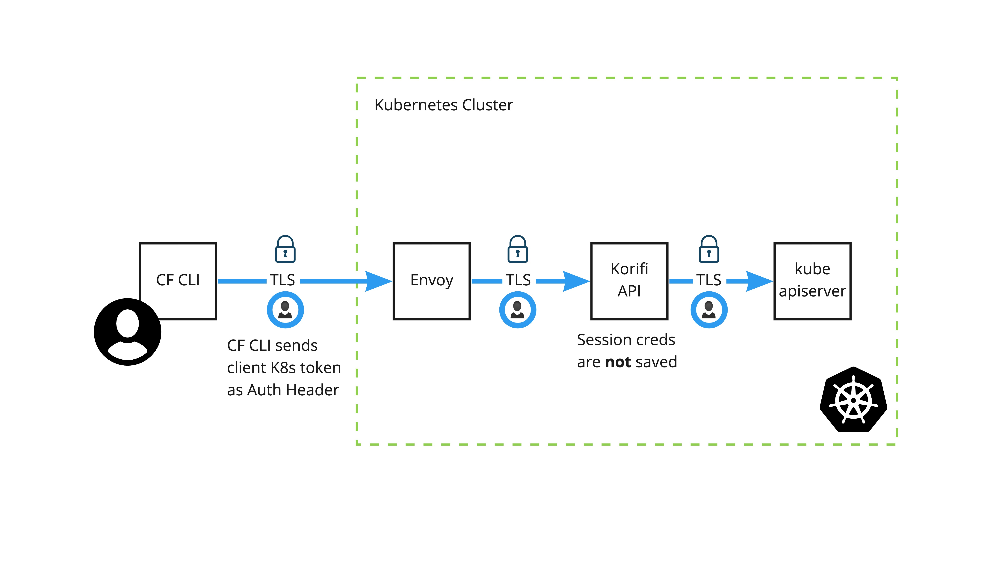

# Korifi Authentication and Authorization Overview

### Background
---
Traditionally, the CF CLI has authenticated with the platform via Cloud Foundry's [User Account and Authentication (UAA)](https://docs.cloudfoundry.org/concepts/architecture/uaa.html) server which acts as an OAuth2 provider. In this model, the Cloud Controller API server validated the user's token and was responsible for most authorization decisions in Cloud Foundry.

With Korifi, we've taken a different approach. Rather than owning Auth(N/Z) and maintaining a list of roles ourselves, we are delegating this responsibility to the [Kubernetes API server](https://kubernetes.io/docs/reference/access-authn-authz/authentication/) and Kubernetes native RBAC. We have updated the CLI to be able to authenticate with the Kubernetes API using the developer's local kubeconfig. The CLI extracts the user's token or client cert/key pair from the authenticated Kubernetes client and sends them on every request over TLS in the Authorization header.
The Korifi API translation layer then instantiates a new Kubernetes API client using the user's credentials to perform requests on their behalf. This client (and the user's credentials) only persists in memory for the duration of the HTTP request.

## Architecture
---

Users must communicate with the Korifi API via https due to the presence of the Auth header which contains the user’s authentication token or client cert/key pair. The Korifi API translates the CF API request into Kubernetes API requests using the provided credentials.

Note that the user is authenticated via their Kubernetes token or client cert/key for each request to the Korifi API, with no persistent session data stored in-between.

### Note on Best Practices
It is generally advisable to use short lived tokens and/or certificates with short expiry dates.
By default, the Korifi API automatically warns users if their cert is longer-lived than one week.
